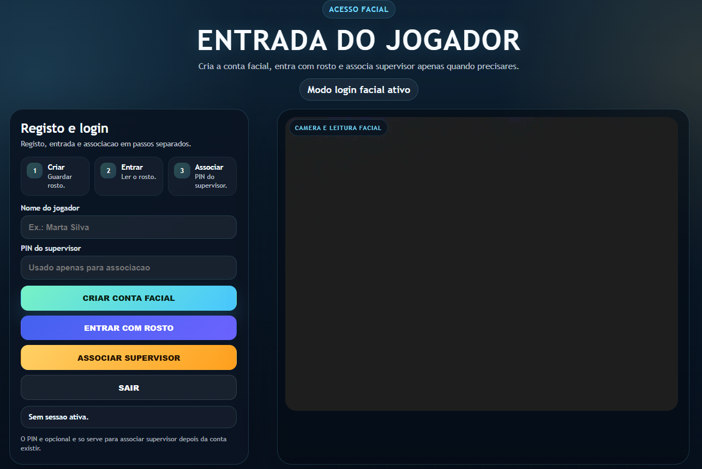
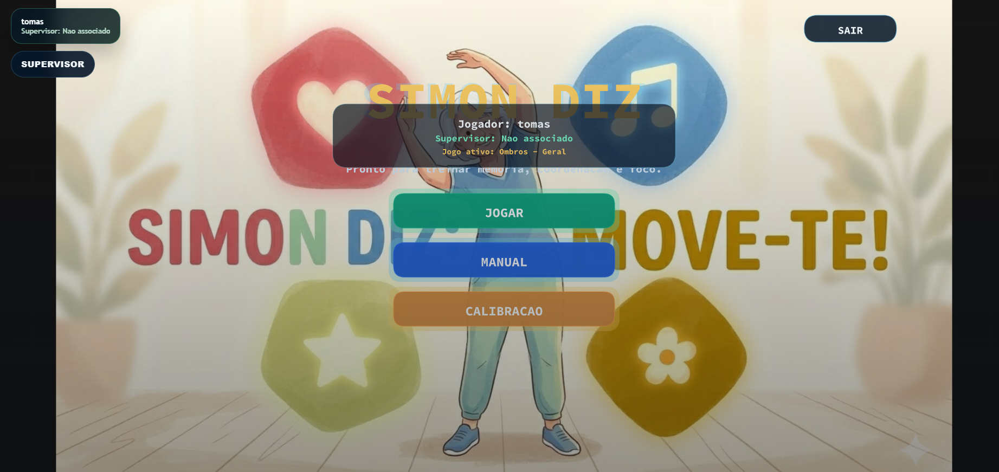

# ActiveSimon

ActiveSimon is an interactive rehabilitation and movement-training web application that combines pose detection, mini-games, facial login, and supervisor-managed training plans.

The project was developed as an academic prototype to make therapeutic exercise more engaging, visual, and personalized. Instead of presenting exercises as a static list, ActiveSimon turns them into guided interactive sessions supported by body tracking and real-time visual feedback.

## Overview

The application runs in the browser and uses:

- `p5.js` for rendering and interaction
- `ml5.js` with `BlazePose` for body pose estimation
- `Supabase` for profile and supervisor-related data
- `localStorage` and Supabase-backed training plans for session persistence

The current implementation includes:

- user authentication flow through the facial login page
- supervisor PIN validation
- assignment of training games to a logged-in player
- multiple rehabilitation-oriented movement games
- a menu showing the active player and assigned training summary
- calibration/manual screens

## Main Features

### User Side

- Facial login and registration flow
- Session-aware player profile
- Assigned training summary displayed in the main menu
- Start training from the currently available assigned games
- Real-time movement interaction using webcam-based pose tracking

### Supervisor Side

- Supervisor access through a PIN
- Supervisor panel embedded in the main application
- Selection of available games for the active player
- Saving a training plan for the selected player

### Training / Gameplay

- Upper-body, lower-body, shoulder, and waist exercise games
- Visual repetition guidance and in-game feedback
- Configurable game catalog with code, label, summary, implementation key, and difficulty presets

## Available Game Categories

At the moment, the catalog includes:

- Lower Limbs - Right
- Lower Limbs - Left
- Lower Limbs - General
- Upper Limbs - Right
- Upper Limbs - Left
- Upper Limbs - General
- Right Shoulder
- Left Shoulder
- Shoulders - General
- Waist

These are defined in [`game-config.js`](./game-config.js).

## Project Structure

```text
ActiveSimon/
|- index.html                  # Main application shell
|- sketch.js                   # p5.js setup, draw loop, webcam and pose detection bootstrap
|- menu.js                     # Main menu, calibration access, training summary UI
|- game.js                     # Core gameplay helpers and implementation registry checks
|- game-config.js              # Game catalog and difficulty metadata
|- training-plan.js            # Training plan loading, persistence, assignment selection
|- supervisor.js               # Supervisor panel and assignment flow
|- auth.js                     # Active player session integration
|- calibrateGame.js            # Calibration-related UI/helpers
|- games/                      # Older game modules
|- games2/                     # Current movement-game implementations
|- face-login/                 # Facial login / registration page
|- assets/                     # Images, backgrounds, and sounds
|- p5/                         # Local p5 distribution
`- supabase/                   # SQL setup scripts for database features
```

## How It Works

### 1. Player authentication

The player logs in through the facial login page in `face-login/index.html`.  
After login, the application stores a lightweight session locally and syncs the current player into the main app.

### 2. Training plan loading

When a player session is available, the app loads:

- a local stored training plan for that player
- and, when available, a Supabase training plan

If no remote or local plan is available, the app falls back to a default local training plan.

### 3. Supervisor assignment

The supervisor opens the panel from the main app, logs in with a PIN, selects the active player, checks the games to assign, and saves the training plan.

### 4. Training execution

When the player starts training, the app launches one of the enabled assigned games and uses webcam-based pose tracking to guide the exercise session.

## Tech Stack

- HTML5
- CSS3
- JavaScript
- p5.js
- ml5.js
- Supabase
- Browser `localStorage`
- Webcam input

## Setup

### Prerequisites

- A local web server such as `XAMPP`
- A modern browser with webcam access enabled
- Internet access for the CDN dependencies used in the HTML files
- A Supabase project configured for login/supervisor data

### Local Run

1. Place the project inside your local web server directory.
2. Start Apache through XAMPP.
3. Open the project in the browser, for example:

```text
http://localhost/ECGM%202526/ActiveSimon/
```

4. Allow webcam permissions when prompted.

### Important Runtime Notes

- The app depends on the webcam for pose detection.
- The face login page and the main app both use Supabase client-side configuration embedded in the code.
- Some features degrade to local behavior if Supabase data is unavailable.

## Supabase Configuration

The repository includes SQL scripts to prepare the supervisor and training-plan support:

- [`supabase/supervisor_auth_schema.sql`](./supabase/supervisor_auth_schema.sql)
- [`supabase/training_plan_schema.sql`](./supabase/training_plan_schema.sql)

### Suggested setup order

1. Create or prepare the Supabase project used by the app.
2. Ensure the facial profile table used by the login page already exists.
3. Run `supabase/supervisor_auth_schema.sql`.
4. Run `supabase/training_plan_schema.sql`.
5. Insert seed data for supervisors and game catalog entries if needed.

### Supervisor schema

The supervisor SQL script creates:

- a `supervisors` table
- a `supervisor_id` reference on `face_profiles`
- an RPC function `validate_supervisor_pin(pin_input text)`

### Training plan schema

The training plan SQL script creates:

- `games_catalog`
- `player_game_assignments`
- indices and difficulty validation constraints

## Current Behavior and Limitations

This repository already demonstrates the intended workflow, but it is still a prototype. The following limitations are important:

- The supervisor panel currently works with the active logged-in player rather than a full remote user-management list.
- Supervisor PIN validation is backed by Supabase, but saving assignments in the panel currently persists a local training plan in the browser.
- The app can read training assignments from Supabase, but the current supervisor UI does not yet write those assignments back to Supabase directly.
- Starting training selects from enabled assigned games and may launch one available assignment rather than stepping through a full programmed session sequence.
- The project contains both older `games/` modules and newer `games2/` modules.
- Some external dependencies are loaded from CDNs instead of being fully bundled.

## Development Notes

### Game catalog

The catalog is centralized in [`game-config.js`](./game-config.js).  
Each entry includes metadata such as:

- `code`
- `name`
- `summary`
- `implementationKey`
- `bodyPart`
- `status`
- `enabled`
- supported `difficulties`

### Training persistence

Training plans are stored per player using browser storage keys in the form:

```text
player_training_plan:<player_id>
```

### Pose detection

The application starts webcam capture and BlazePose detection from [`sketch.js`](./sketch.js).  
Detected keypoints are then used by the active game logic to evaluate movements and repetitions.

## Suggested README Images

To improve the GitHub page, you may later add:

- a screenshot of the main menu
- a screenshot of the supervisor panel
- a screenshot of a running exercise game
- a short GIF showing body tracking in action

Example section:

```md
## Screenshots


```

## 📸 Visualização do Protótipo

Aqui estão algumas capturas de tela do sistema em funcionamento, demonstrando a interface de usuário e o fluxo de acesso.

| Login Facial (Reconhecimento) | Menu Principal (Treinos) |
| :---: | :---: |
|  |  |
| *Interface de autenticação biométrica* | *Painel de seleção de exercícios* |

> **Nota:** As imagens acima mostram a integração entre o sistema de login via `face-api/Supabase` e o dashboard principal desenvolvido em `p5.js`.
## Future Improvements

- Write supervisor assignments directly to Supabase
- Add a richer session scheduler instead of random assigned game launch
- Expand exercise/game variety
- Improve analytics and progress tracking
- Add dedicated accessibility and configuration settings
- Improve deployment and environment configuration management

## Academic Context

This project was developed in an academic context as a prototype exploring the use of interactive technologies, computer vision, and gamification for rehabilitation-oriented exercise support.

## License

No license file is currently included in this repository.

If you intend to publish or reuse this project publicly, consider adding a license such as `MIT`.
